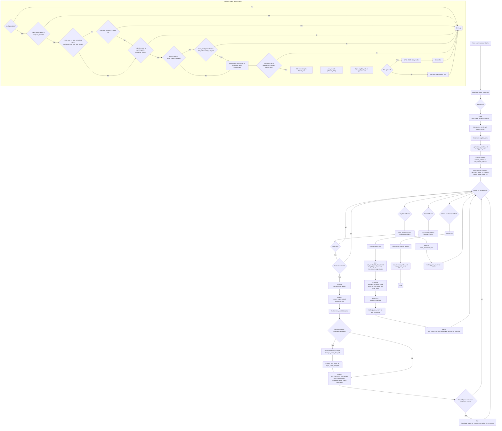

# Deep Dive: `input_habit_logger.lua` Script Logic

This document provides a detailed walkthrough of the `input_habit_logger.lua` script, the core component responsible for capturing and logging user input habits within the Rime Input Method Engine. It's intended for developers and advanced users who wish to understand its internal workings or contribute to its development.

## Table of Contents

1.  [Introduction](#introduction)
2.  [Overall Logic Flow (Diagram)](#overall-logic-flow-diagram)
3.  [Core Components and Functions](#core-components-and-functions)
    *   [Initialization (`init` function)](#initialization-init-function)
    *   [Configuration Loading](#configuration-loading)
    *   [JSON Encoding](#json-encoding)
    *   [Logging Core (`log_json_event` function)](#logging-core-log_json_event-function)
    *   [Rime Event Processing](#rime-event-processing)
        *   [`get_current_candidate_info`](#get_current_candidate_info)
        *   [`main_processor_func` (Key Press Handler)](#main_processor_func-key-press-handler)
        *   [`on_commit_callback` (Commit Handler)](#on_commit_callback-commit-handler)
    *   [State Variables](#state-variables)
    *   [Termination (`fini` function)](#termination-fini-function)
4.  [Event Types and Data Fields](#event-types-and-data-fields) (Refer to `lua_script_architecture_zh.md`)

## Introduction

The `input_habit_logger.lua` script is designed to be loaded by Rime's `lua_processor`. Its primary functions are:
*   To listen to user key presses and input events within Rime.
*   To capture relevant data about these events, such as input buffer content, candidate selections, and committed text.
*   To format this data into JSON objects.
*   To write these JSON objects to a log file, based on user-defined configurations.

The script is highly configurable through `input_habit_logger_config.lua`, allowing users to control what is logged and how.

## Overall Logic Flow (Diagram)

The following Mermaid diagram illustrates the high-level operational flow of the script:

## Core Components and Functions

### Initialization (`init` function)

This function is called once when the Rime Lua processor loads the script. Its responsibilities are:
1.  **Load Configuration**: Calls `pcall` to safely `require` the `input_habit_logger_config.lua` file.
2.  **Merge Configuration**: If user configuration is loaded successfully, it's merged deeply with the default `config` table.
3.  **Determine Log File Path**: Calls `get_log_file_path()` to establish where logs will be written.
4.  **Log Session Start**: Calls `log_json_event` to record a `session_start` event, including the current schema ID.
5.  **Connect Commit Notifier**: Connects the `on_commit_callback` function to Rime's `commit_notifier`. This ensures `on_commit_callback` is triggered whenever Rime commits text.
6.  **Initialize State**: Resets the `last_input_state_for_commit` table.

### Configuration Loading

*   A default `config` table is defined within `input_habit_logger.lua`.
*   The script attempts to load `input_habit_logger_config.lua`. If found and valid, its settings override the defaults.
*   The `merge` local function handles a deep merge of configuration tables, allowing nested structures in the user config.
*   `get_log_file_path()`:
    *   Prioritizes `config.log_file_path` if set by the user.
    *   Otherwise, it attempts to determine the default Rime user directory and log file path based on the operating system (Windows, macOS, Linux).

### JSON Encoding

A simple, custom JSON encoder is implemented:
*   `escape_str(s)`: Escapes special characters in strings for JSON compatibility.
*   `table_to_json(val, is_array_hint)`: Recursively converts a Lua table to a JSON string. It attempts to distinguish between JSON arrays and objects.
    *   `is_array_hint`: Helps in correctly identifying if a table should be treated as an array or an object.
*   `to_json_value_func(val)`: Converts individual Lua values (string, number, boolean, nil, table) to their JSON string representation. Handles `NaN` and `Infinity` as `null`.
*   `json_encode(tbl)`: The main entry point for encoding a Lua table to a JSON string.

### Logging Core (`log_json_event` function)

This is the central function responsible for deciding whether to log an event and then writing it to the file.
It takes `event_data` (a Lua table) as input.

**Filtering Logic Steps:**

1.  **Global Enable Check**: If `config.enabled` is `false`, logging is skipped.
2.  **Event Type Enable Check**: If the `event_data.event_type` is not enabled in `config.log_events`, logging is skipped.
3.  **Non-First Choice Filter (for `text_committed` only)**: If `event_type` is `text_committed` AND `config.log_only_non_first_choice` is `true`, the event is only logged if `event_data.selected_candidate_rank` is 1 or greater (i.e., not the first choice).
4.  **Field Rules Check**: Retrieves `field_rules` from `config.log_fields[event_type]`. If no rules are defined for this event type, nothing is logged.
5.  **Subtype Filter (for `input_state_changed` only)**: If `event_type` is `input_state_changed`, it checks if `event_data.event_subtype` is enabled in `field_rules.event_subtype`. If not, logging is skipped.
6.  **Field Filtering**: Constructs `filtered_data` by iterating through `event_data`. A field is included if:
    *   It's not `event_type` itself.
    *   A rule for it exists in `field_rules`.
    *   For `event_subtype`, it's included directly if the subtype passed the filter in step 5.
    *   For other fields, the rule in `field_rules[key]` must be `true`.
7.  **Empty Event Check**: If `filtered_data` only contains `event_type` (meaning all other fields were filtered out), logging is skipped.
8.  **Timestamp and Write**:
    *   An ISO 8601 timestamp (UTC with milliseconds) is added to `filtered_data`.
    *   `filtered_data` is encoded to a JSON string using `json_encode`.
    *   The JSON string is appended to the `log_file_path`.
    *   If the file cannot be opened, an error is logged via `rime.log_info` (if available).

### Rime Event Processing

#### `get_current_candidate_info(context, max_to_display)`

Helper function to extract information about the current candidate menu from the Rime `context`.
*   Returns a table containing:
    *   `candidates_list`: A list of candidate texts (up to `max_to_display`, default 5).
    *   `first_candidate_text`: The text of the currently selected/highlighted candidate (usually the first one).
    *   `has_menu`: Boolean indicating if a candidate menu is currently active.
*   It safely accesses context properties using `pcall` where necessary.

#### `main_processor_func(key, env)`

This is the main Rime processor function, called for each relevant key press.
`key`: A Rime key event object.
`env`: The Rime environment object.

**Logic:**

1.  **Initial Checks**: Ignores invalid keys (e.g., release events, 0x0000 key_code) or if Rime context is unavailable.
2.  **Error Handling**: The main logic is wrapped in `pcall` to catch and log any errors.
3.  **Get Input Buffer**: Retrieves `current_input_buffer` (script text or preedit).
4.  **Page Tracking**:
    *   If `current_input_buffer` changes from `last_seen_input_buffer`, `current_page_index` is reset to 0.
    *   If the pressed key is a navigation key (`Page_Down`, `Next`, `Page_Up`, `Prev`), `current_page_index` is updated.
5.  **Get Candidate Info**: Calls `get_current_candidate_info`.
6.  **Log `input_state_changed` Event (V2.2 Logic)**:
    *   If a menu is active and candidates are present:
        *   Determines `event_subtype` based on the key pressed:
            *   `menu_navigation` (Up, Down, Page_Up, Page_Down)
            *   `input_rejected` (Escape)
            *   `manual_segmentation` (Ctrl+Left, Ctrl+Right)
            *   `buffer_edit` (character keys, BackSpace)
            *   `other_key` (default)
        *   Calls `log_json_event` with `event_type = "input_state_changed"` and the collected data.
7.  **Update `last_input_state_for_commit` (V14.1 Core Logic)**: This table stores the state *before* a potential commit.
    *   If a menu is active: `input_buffer`, `first_candidate`, `candidates` list, `page_index`, and current `timestamp` are stored.
    *   If no menu: `input_buffer`, `timestamp` are stored; `first_candidate` and `candidates` are `nil`; `page_index` is reset.
    *   `key_action_for_selection` is reset to `nil`. If the menu is active and the key is `space` or a number `[1-9]`, `key_action_for_selection` is set to the key name. This helps `on_commit_callback` determine how the selection was made.
8.  **Error Logging**: If `pcall` caught an error, an `error` event is logged.
9.  Returns `rime.process_results.kNoop` (no operation), as this script is a passive logger.

#### `on_commit_callback(context)`

This function is triggered by Rime's `commit_notifier` when text is committed to the application.
`context`: The Rime context object at the time of commit.

**Logic:**

1.  **Get Committed Text**: Retrieves the `committed_text_val`.
2.  **Retrieve Pre-Commit State**: Uses data from `last_input_state_for_commit` (which was set by `main_processor_func` *before* the commit occurred):
    *   `input_sequence_at_commit` (from `last_input_state_for_commit.input_buffer`)
    *   `key_action` (from `last_input_state_for_commit.key_action_for_selection`)
    *   `page_index`
3.  **Calculate `selected_rank`**: This is crucial for accuracy analysis.
    *   Default is -1 (e.g., direct commit without menu, or unknown).
    *   Page size is assumed to be 6 (as per comment, though not strictly enforced by Rime itself).
    *   If `key_action` was `"space"`:
        *   It iterates through `last_input_state_for_commit.candidates` to find the `local_index` of the `committed_text_val`. This accounts for Up/Down arrow navigation before pressing Space.
        *   `selected_rank = (page_index * page_size) + local_index`.
        *   If not found (fallback), assumes first candidate on the current page: `page_index * page_size`.
    *   If `key_action` was a number `N`:
        *   `local_index = N - 1`.
        *   `selected_rank = (page_index * page_size) + local_index`.
4.  **Determine `selection_method`**:
    *   Based on `key_action` and `selected_rank`. Examples: `"first_choice_space"`, `"nth_choice_number_2"`, `"direct_commit_no_menu"`.
5.  **Log `text_committed` Event**: Calls `log_json_event` with all collected data, including:
    *   `committed_text`
    *   `input_sequence_at_commit`
    *   `selection_method`
    *   `selected_candidate_rank`
    *   `source_input_buffer` (from `last_input_state_for_commit`)
    *   `source_candidates_list` (from `last_input_state_for_commit`)
    *   `source_first_candidate` (from `last_input_state_for_commit`)
    *   `source_event_timestamp` (timestamp of the pre-commit state)
6.  **Reset `key_action_for_selection`**: `last_input_state_for_commit.key_action_for_selection` is set to `nil` to prepare for the next commit.

### State Variables

These are global (local to the script module) variables that maintain state across function calls:

*   `config`: The merged configuration table.
*   `log_file_path`: The determined path to the log file.
*   `last_input_state_for_commit`: A table that stores a snapshot of the input state (buffer, candidates, page index, timestamp, and the key that might trigger a commit) right before a text commit might occur. This is crucial for `on_commit_callback` to understand the context of the commit.
    *   `.input_buffer`: The script text/input buffer content.
    *   `.first_candidate`: The text of the first candidate.
    *   `.candidates`: The list of current candidates.
    *   `.page_index`: The current candidate page index.
    *   `.timestamp`: Timestamp when this state was captured.
    *   `.key_action_for_selection`: The key (`"space"` or a digit) that is about to cause a commit, if applicable.
*   `current_page_index`: Tracks the current page number of the candidate menu (0-indexed). Reset when the input buffer changes.
*   `last_seen_input_buffer`: Stores the input buffer content from the previous key event, used to detect changes and reset `current_page_index`.

### Termination (`fini` function)

Called when the Rime Lua processor unloads the script (e.g., Rime shutdown or schema switch).
1.  **Disconnect Commit Notifier**: Disconnects the `on_commit_callback` from the `commit_notifier` if the connection exists.
2.  **Log Session End**: Calls `log_json_event` to record a `session_end` event.

---

This deep dive should provide a comprehensive understanding of the `input_habit_logger.lua` script's architecture and logic. For details on configurable fields and event types, please refer to the `docs/lua_script_architecture_zh.md` document.
